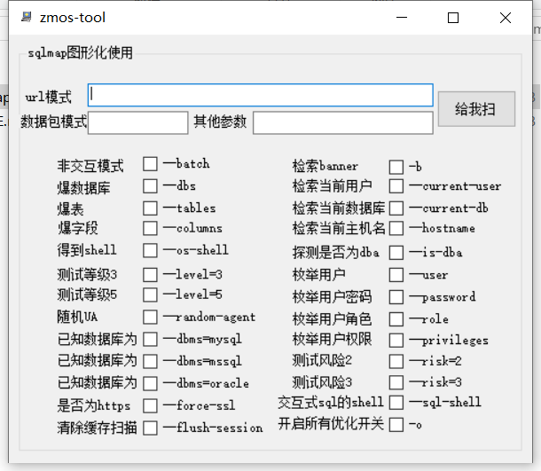
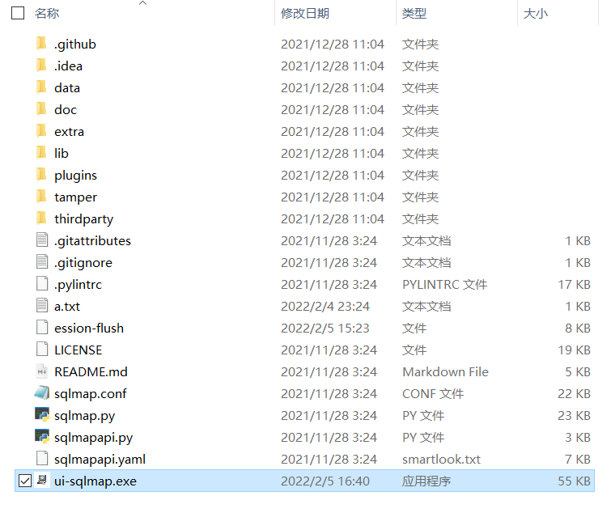
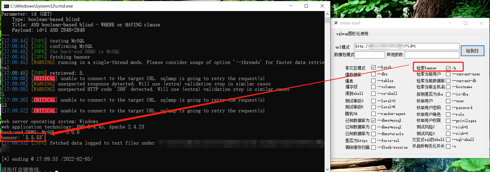

# UI-SQLMAP

```
	一个将sqlmap界面化使用的小工具，默认具备了26个常用参数，可以省去您平常查询参数与输入参数时的不便，力求简洁、高效。
```

## Demo




## 快速使用

```
	将本工具放在sqlmap的同一目录下，然后点击运行即可
```



```
	url模式：直接在输入框内输入网址即可；
	数据包模式：（例：将数据包写入sqlmap同目录下的a.txt，然后再在输入框内输入-r a.txt即可，其他目录需跟上具体的路径。
	其他参数：当提供的26个参数未存在您所需要的参数时，可以在此处编辑自定义参数进行扫描
	复选框：点击所需要用到的参数，扫描时即可带上对应的参数
```


## 靶场演示




## 免责声明

```
本工具仅面向合法授权的企业安全建设行为，在使用本工具进行检测时，您应确保该行为符合当地的法律法规，并且已经取得了足够的授权。  

如您在使用本工具的过程中存在任何非法行为，您需自行承担相应后果，本人将不承担任何法律及连带责任。 

在使用本工具前，请您务必审慎阅读、充分理解各条款内容，限制、免责条款或者其他涉及您重大权益的条款可能会以加粗、加下划线等形式提示您重点注意。 除非您已充分阅读、完全理解并接受本协议所有条款，否则，请您不要使用本工具。

您的使用行为或者您以其他任何明示或者默示方式表示接受本协议的，即视为您已阅读并同意本协议的约束。 
```